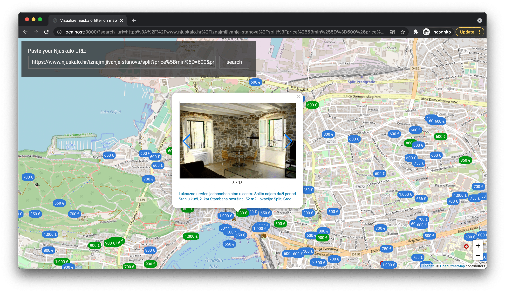

# What is for?

This application was created to help us finding the long-term flat in Croatia. For example in Split there were more than 60 pages of flats with ~30 flats/page. Filters significantly narrowed down, up to 35 pages, which is still unreal to choose from.

After application is implemented, we understood that it's useful for other purposes, like choosing the garages, finding the closest place where someone sell the bicycles, etc.

# Running an application

## With docker / docker-compose

```shell
docker-compose up
```

## With plain old Node.JS

It was tested on 14th version of Node.JS, so make sure you're using at least that version.
If you don't want verbose logging and restart on code changes:
```shell
npm run start
```

Otherwise use:
```shell
npm run start-dev
```

# How to use

Once your application is up and running, open your IP address with port 3000. If you're deploying your app on local machine, use: http://localhost:3000 .

## Legend

Markers are separated to:


-  Green. It's a marker of exact object location.
-  Blue. It shows us that the position is approximate and hovering that marker will lead to displaying the range of where this object is located. 


When you click on marker, detailed information, including the slider with photos is displayed.




# Technical details

## Backend side

### Task based API

It's running the long-term task to parse the information from Njuskalo, 
so that to make sure for user that some progress is happening, task id is returned and it's polling by frontend.


### Caching

It uses Keyv without possibility to being configured via env variables, or smth like it.
Right now it stores the cache in the `cache.json` and stores the whole HTML content returned by the Njuskalo.

It helped during development to decrease the number of requests and to add new features without rerequesting the data.

### Logging

It uses the pino logs with very detailed description of every step during parsing. Use [`fx`](https://github.com/antonmedv/fx), [`jq`](https://stedolan.github.io/jq/), or [`pino-pretty`](https://github.com/pinojs/pino-pretty) to make these logs readable in a conventient format.

### Error handling

Error handling is very poor. So on any changes in Njuskalo HTML structure you may expect application to be stopped
with a weird JS error. The same for incorrect input.

Feel free to open PR with appropriate changes :)

## Frontend side

It keeps as simple as possible without any pre-processing steps, so that even libraries from the CDN are used.


### Limitations

We don't parse more than 40 pages. The map will be lagging and I don't want to introduce clustering. If you want more data,
use filters instead.


# Roadmap

- Add Google API to get the address when the map is not present
- Add Google Translate to make the translation to your native language
